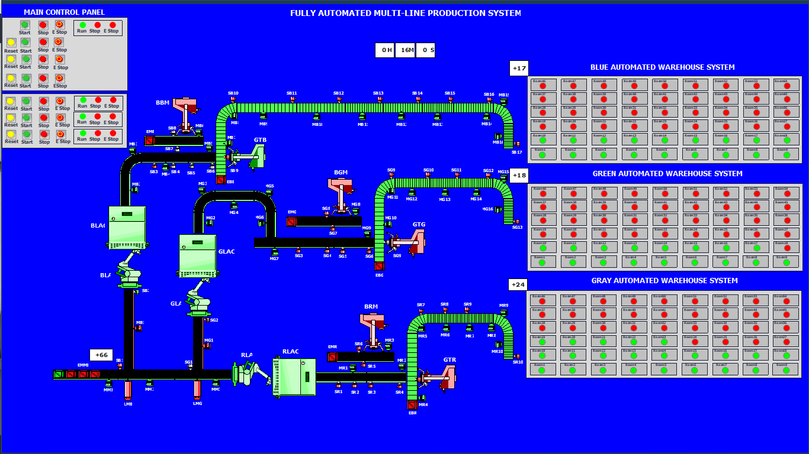
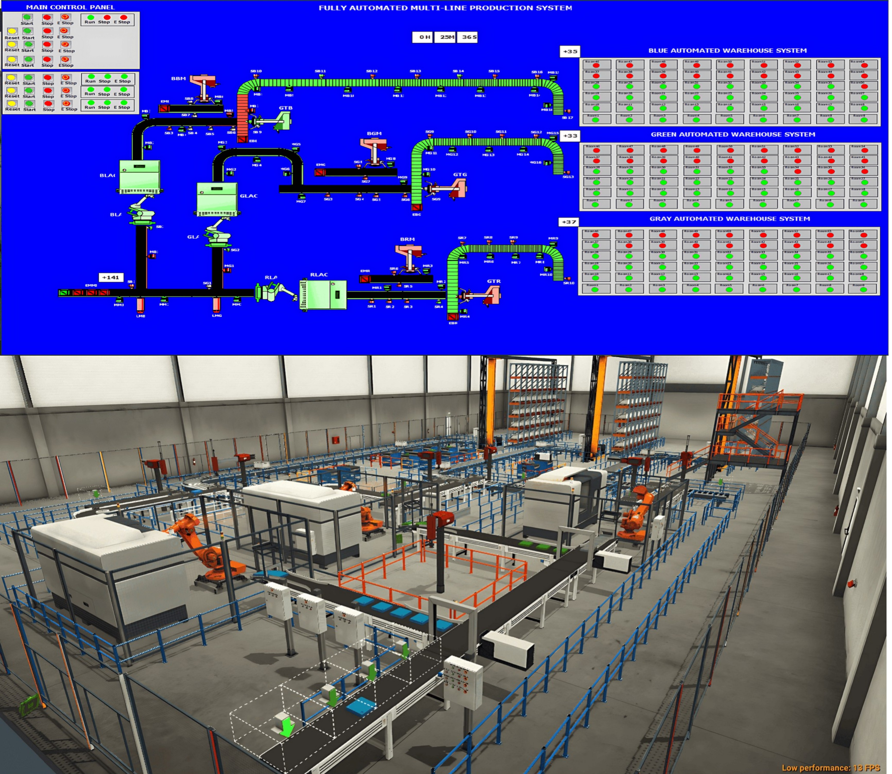

# 🏭 Multi-Line Automated Production & Storage System (MLAP-ISW)
Multi-line production and storage system (MLAP-ISW) using Siemens TIA Portal (SCL), Factory I/O, and SCADA.
> **An integrated, multi-line smart manufacturing and automated warehouse system designed with Siemens TIA Portal (SCL) and simulated in Factory I/O 3D environment.**
---
## 📌 Project Overview
The **MLAP-ISW** (Multi-Line Automated Production and Storage System) is an advanced industrial control project showcasing modern smart factory architecture. The system coordinates three concurrent manufacturing lines responsible for processing metal parts in three different colors (Blue, Green, and Gray). 
It features automated material handling, CNC machining, part duplication, pneumatic assembly, crate packaging, collision-free conveyor synchronization, and an intelligent Automated Storage and Retrieval System (ASRS).
---
## 🖼️ Visual Results & Simulation Showcase

| 3D Factory Simulation | SCADA Control Dashboard |
| :--- | :--- |
|  |  |

<p align="center">
  <b>System Integration (Factory I/O & SCADA)</b><br>
  
</p>
---
## 🛠️ Technology Stack & Tools
* **PLC Programming:** Siemens TIA Portal (SCL - Structured Control Language)
* **PLC Hardware Target:** Siemens S7-1200 / S7-1500
* **3D Simulation:** Factory I/O
* **Control Strategy:** Finite State Machines (FSM), Timer-based Synchronization, Collision & Stacking Prevention
* **Supervisory Control:** SCADA Interface (Real-time tracking, Storage Occupancy Matrix)
---
## ⚙️ System Architecture & Workflow
The production process is structured across three synchronized concurrent lines:
1. **Sorting & Material Handling:** Raw metal parts (Blue, Green, Gray) are sorted and transferred to CNC machining units.
2. **Machining & Duplication:** Parts undergo CNC processing, followed by part duplication using conveyor-based alignment.
3. **Pneumatic Assembly System:** High-precision vertical and horizontal pneumatic actuators press two separate components into a unified finished product.
4. **Crate Packaging:** Assembled products are automatically picked up by a multi-axis pneumatic system and placed inside transport crates.
5. **Smart Storage Platform (ASRS):** Crates travel via interlocked conveyors to an automated warehouse. An intelligent positioning algorithm maps crates into predetermined grid coordinates for optimal space utilization.
6. **Safety & Collision Prevention:** Distributed proximity and photoelectric sensors prevent material stacking and conveyor jams.
---
## 💻 Code Structure Highlights
The entire system logic is implemented in **Structured Control Language (SCL)**, emphasizing modularity, robust state handling, and clean execution.
```scl
// Example: State Transition Logic for Automated Pick & Place Assembly
CASE #CurrentState OF
    10: // Wait for Part Presence
        IF "Sensor_Part_In_Position" AND "System_Active" THEN
            "Pneumatic_Clamp" := TRUE;
            #CurrentState := 20;
        END_IF;
    20: // Vertical Press Motion
        "Actuator_Z_Down" := TRUE;
        IF "Sensor_Z_Lower_Limit" THEN
            "Actuator_Z_Down" := FALSE;
            #CurrentState := 30;
        END_IF;
        
    // Additional sequential state execution...
END_CASE;
---

## 📑 Project Documentation & Intellectual Property

* 📄 **Full Technical Report / Documentation:**  
  You can view and download the complete documentation for this project:  
  👉 **[Download Project PDF Report](./MLAP_ISW_Project_Report.pdf)**

> **Note on Project Source Files:**  
> The native TIA Portal project files (`.ap16/18`) and 3D Factory I/O scene files are retained as proprietary intellectual property. 
> Visual outputs, system architecture, sample SCL logic, and the technical report are provided in this repository for demonstration purposes.

---

## 👤 Author

**Eng. Salah Almolad**  
*Mechatronics & Industrial Automation Engineer*  
*Specializing in Industrial Control Systems, PLC/SCADA Programming, and Virtual Commissioning.*
